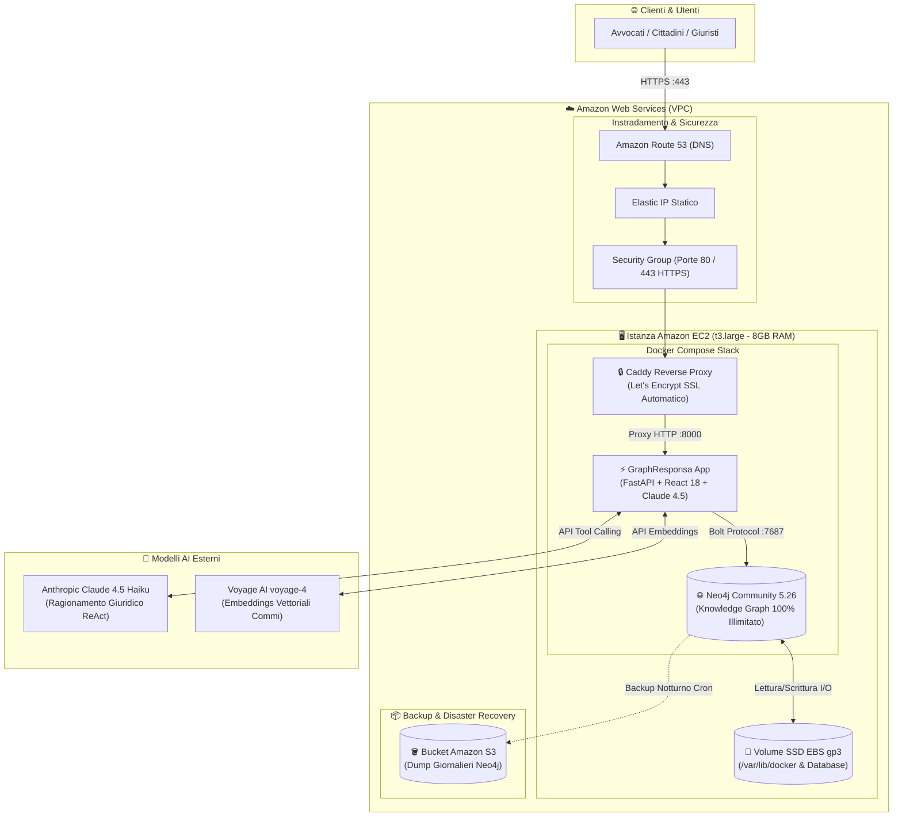

# ☁️ Architettura & Deployment su Amazon Web Services (AWS)

Questa cartella contiene tutti i file Infrastructure-as-Code (IaC), container Docker e script di automazione per distribuire **GraphResponsa** su **AWS** in modo sicuro, performante e a costi ottimizzati.

---

## 🏗️ 1. Diagramma Architetturale AWS



---

## 📁 2. File Inclusi nella Cartella `aws/`

| File | Descrizione |
|---|---|
| [`Dockerfile`](./Dockerfile) | Multi-stage build: compila l'app **React 18** e avvia il server **FastAPI/Uvicorn** con l'agente LangGraph. |
| [`docker-compose.prod.yaml`](./docker-compose.prod.yaml) | Orchestrazione completa dei 3 container: **Neo4j Community**, **App FastAPI**, **Caddy Proxy**. |
| [`Caddyfile`](./Caddyfile) | Configurazione di **Caddy** per il rilascio automatico dei certificati **SSL HTTPS (Let's Encrypt)** e supporto per Server-Sent Events (SSE). |
| [`cloudformation.yaml`](./cloudformation.yaml) | Template Infrastructure-as-Code (IaC) per creare l'intera infrastruttura AWS (EC2, Elastic IP, Security Group, S3) con 1 click. |
| [`deploy.sh`](./deploy.sh) | Script bash per il deployment e l'aggiornamento automatico da GitHub con un solo comando. |
| [`backup-neo4j.sh`](./backup-neo4j.sh) | Script di backup automatico del grafo Neo4j con caricamento sicuro su Amazon S3. |
| [`.env.prod.example`](./.env.prod.example) | Template delle variabili d'ambiente per il server di produzione. |

---

## 🚀 3. Guida al Deployment Passo-Passo

### Opzione A: Deploy con AWS CloudFormation (1-Click)
1. Accedi alla console [AWS CloudFormation](https://console.aws.amazon.com/cloudformation).
2. Clicca su **Create Stack** $\rightarrow$ **Upload a template file** e seleziona [`aws/cloudformation.yaml`](./cloudformation.yaml).
3. Inserisci i parametri:
   * **InstanceType:** `t3.large` *(2 vCPU, 8 GB RAM - Consigliato)*
   * **VolumeSize:** `50` *(GB SSD gp3)*
   * **DomainName:** il tuo dominio (es. `responsa.tuodominio.sm`).
4. Clicca **Create Stack**. AWS creerà automaticamente l'istanza EC2, il firewall, l'indirizzo IP statico e il bucket S3.

---

### Opzione B: Deploy Manuale su qualsiasi Istanza EC2 (Ubuntu 22.04 LTS)

1. **Connettiti all'istanza via SSH:**
   ```bash
   ssh -i tua-chiave.pem ubuntu@tuo-ip-ec2
   ```

2. **Clona il repository GitHub:**
   ```bash
   git clone https://github.com/simorina/GraphResponsa.git
   cd GraphResponsa
   ```

3. **Crea il file delle variabili d'ambiente:**
   ```bash
   cp aws/.env.prod.example aws/.env.prod
   nano aws/.env.prod
   ```
   *(Inserisci la tua `ANTHROPIC_API_KEY`, `VOYAGE_API_KEY` e una password per Neo4j).*

4. **Avvia l'applicazione:**
   ```bash
   chmod +x aws/deploy.sh aws/backup-neo4j.sh
   ./aws/deploy.sh
   ```

L'applicazione sarà immediatamente attiva e protetta in HTTPS con certificato SSL automatico Let's Encrypt!

---

## 💰 4. Stima dei Costi Mensili su AWS

| Servizio AWS | Dettaglio Risorse | Costo Mensile Stimato |
|---|---|---|
| **Amazon EC2 (`t3.large`)** | 2 vCPU, 8 GB RAM (Attiva 24/7/365) | **~$60 / mese** |
| **Amazon EBS Storage (gp3)** | 50 GB SSD ad alte prestazioni (3.000 IOPS) | **~$4 / mese** |
| **Elastic IP (Statico)** | 1 IP pubblico associato all'istanza | **$0 / mese** |
| **Amazon S3 (Backup)** | Bucket per archivio dump Neo4j giornalieri (50 GB) | **~$1 / mese** |
| **Licenza Neo4j Community** | Open Source (GPLv3) | **$0 / mese (GRATIS)** |
| **TOTALE INFRASTRUTTURA AWS** | | **~ $65 / mese** |
