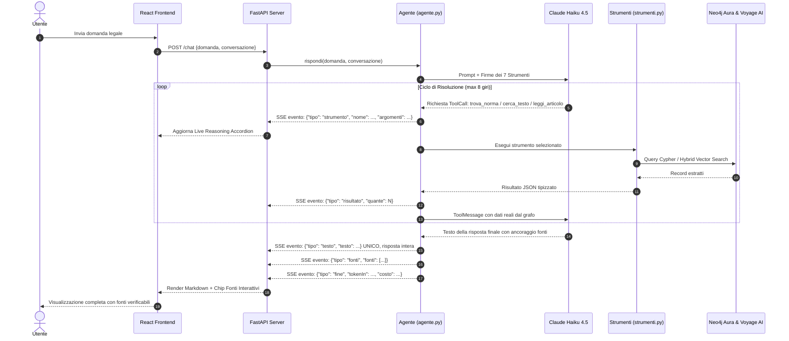
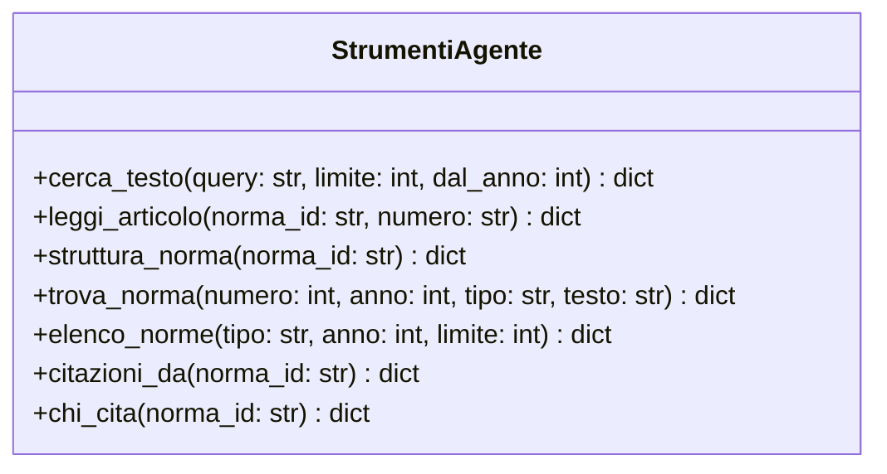
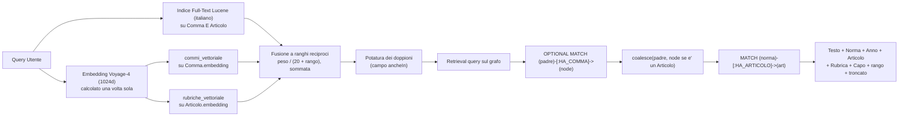
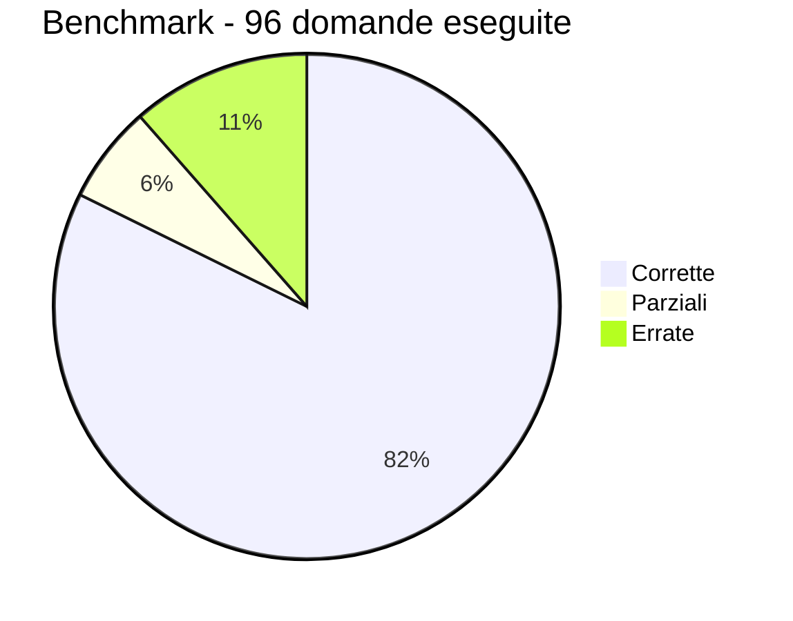

# Architettura dell'Agente e dell'Interfaccia

Agente conversazionale avanzato che risponde a quesiti sulla normativa della Repubblica di San Marino consultando il Knowledge Graph attraverso strumenti tipizzati e ricerca ibrida.

**Stato aggiornato:** operativo su **11.134 atti con testo integrale** (16 tipologie:
leggi, decreti, regolamenti, notifiche, ordinanze, statuti, errata corrige, verbali),
**268.818 nodi** e **350.835 relazioni**. In produzione su AWS dietro CloudFront, con
identita' Cognito e conversazioni persistenti su DynamoDB.

---

## 1. Il Principio Fondamentale e Architettura di Sistema

### 1.1 Il Principio: Claude non parla direttamente con Neo4j

Non esiste alcuna connessione diretta fra il modello linguistico e il database. Claude:
* **Non ha credenziali di accesso** al database.
* **Non genera né esegue codice Cypher arbitrario** (evitando errori, injection o allucinazioni sintattiche).
* **Non vede lo schema grezzo del database.**

Il collegamento è un **ciclo asimmetrico e controllato** orchestrato interamente dal codice Python:
1. Il modello può solo **scegliere quale strumento tipizzato invocare** tra i 7 disponibili e passare argomenti validati.
2. Il codice Python esegue la funzione corrispondente con query Cypher pre-verificate e parametrizzate.
3. Il risultato viene restituito a Claude come `ToolMessage`.

### 1.2 Schema Architetturale Completo (Mermaid)

```mermaid
flowchart TB
    subgraph UI["1. Frontend Layer (React 19 + Vite + Tailwind v4)"]
        User(["👤 Utente"]) <-->|Interazione Chat| InputBar["Input Bar Flottante"]
        InputBar --> MessageList["Message List & Reasoning Accordion"]
        MessageList --> SourceModal["Source Modal (Testo Integrale Comma)"]
        Sidebar["Sidebar (Knowledge Graph Stats Live)"]
    end

    subgraph API["2. Backend Server (FastAPI + SSE Stream)"]
        InputBar -->|POST /chat (Streaming SSE)| ChatEndpoint["Endpoint /chat"]
        Sidebar -->|GET /stato (Polling / Metrics)| StatoEndpoint["Endpoint /stato"]
        ChatEndpoint -->|Generatore Eventi SSE| AgentEngine["LangChain 1.x Engine (agente.py)"]
        ChatEndpoint -.->|Flusso Testo & Eventi Token/Fonti| MessageList
    end

    subgraph Agent["3. AI Reasoning Layer (Anthropic Claude)"]
        AgentEngine <-->|Prompt di Sistema + Firme Tool| Claude["Claude 4.5 Haiku (claude-haiku-4-5)"]
        AgentEngine -->|Esecuzione Dispatcher| ToolBridge["Python Tool Bridge (strumenti.py)"]
    end

    subgraph Data["4. Knowledge & Vector Layer (Neo4j & Voyage AI)"]
        ToolBridge -->|7 Funzioni Tipizzate @tool| Tools["Registro Strumenti"]
        Tools -->|Query Cypher Parametrizzate| Neo4j[("Neo4j Aura Graph Database")]
        Tools -->|Query Vector Embeddings| Voyage["Voyage AI API (voyage-4 1024d)"]
        Voyage -.->|Vettore Similarità Cosina| Neo4j
        StatoEndpoint -->|Cache Query Conteggi| Neo4j
    end

    style User fill:#d4a359,stroke:#8a701a,stroke-width:2px,color:#000
    style Claude fill:#7fb2d4,stroke:#2b78b8,stroke-width:2px,color:#000
    style Neo4j fill:#008cc1,stroke:#005f87,stroke-width:2px,color:#fff
    style Voyage fill:#6366f1,stroke:#4338ca,stroke-width:2px,color:#fff
```

### 1.3 Lo Stack Tecnologico

| Componente | Scelta | Ruolo & Rationale |
|---|---|---|
| **Interfaccia Web** | **React 19 + Vite + Tailwind v4** | UI in stile ChatGPT / Claude con accordion per il ragionamento, chip delle fonti e visualizzatore di norme. |
| **Server Web** | **FastAPI + Uvicorn** | Canale SSE: la UI mostra in diretta quali strumenti vengono invocati. La **risposta** invece non e' incrementale, arriva in un unico evento a fine ciclo (vedi §2.1). |
| **Orchestrazione Agente** | **LangChain 1.x (`create_agent`)** | Ciclo ReAct, max 8 giri di strumenti. In locale la memoria e' `InMemorySaver`; in produzione il checkpointer DynamoDB, che rende i container senza stato. |
| **Modello di Ragionamento (LLM)** | **Anthropic `claude-haiku-4-5`** | Bassa latenza, alta fedeltà alle istruzioni del prompt e costo contenuto ($1 / $5 MTok). |
| **Knowledge Graph** | **Neo4j Aura** | Grafo nativo con indici full-text Lucene e vincoli di unicità idempotenti. |
| **Modello di Embedding** | **Voyage AI (`voyage-4`)** | 1024 dimensioni. Trasforma testo in numeri: e' cio' che permette di trovare una norma con parole diverse dalle sue. Vedi §6. |
| **Memoria delle Conversazioni** | **DynamoDB** (`langgraph-checkpoint-dynamodb`) | I checkpoint NON stanno su Aura: `03_load.py --reset` cancellerebbe le chat di tutti a ogni ricarico del grafo. |

---

## 2. Il Ciclo di ReAct dell'Agente (Sequence Diagram)



### 2.1 Perche' la risposta non e' incrementale

Il canale resta SSE, ma trasporta due cose con tempi diversi.

Gli eventi `strumento` e `risultato` partono **appena accadono**: una
consultazione dura 8 secondi mediani, 13 al novantesimo percentile e 22 nel
caso peggiore (misurato su 96 domande in produzione), e tanto silenzio si
legge come un blocco. La scia del ragionamento e' cio' che rende leggibile
l'attesa, quindi resta in diretta.

Il testo no. Il modello scrive lungo tutto il ciclo - le frasi di servizio prima
di uno strumento, poi la risposta - e quei blocchi ora si accumulano e partono
insieme in **un solo evento**, subito prima di `fonti` e `fine`.

La ragione e' la resa: la risposta e' Markdown, e il Markdown si legge solo per
intero. Consegnato a frammenti, il browser rende stati intermedi in cui la
sintassi e' a meta' - una tabella senza le righe, un blocco di codice non ancora
chiuso, un grassetto con un solo asterisco - e la pagina sussulta a ogni token.

Sul piano tecnico, `rispondi()` non usa piu' lo `stream_mode` `"messages"` di
LangGraph, che serviva a intercettare i frammenti: bastano gli `updates`, da cui
si legge il testo degli `AIMessage` gia' completo. Lato interfaccia il cursore
lampeggiante e' stato tolto: quando il testo compare, e' gia' finito.

---

## 3. Il Registro degli Strumenti (7 Typed Tools)

Il modello non esegue mai codice Cypher arbitrario: può esclusivamente invocare le 7 funzioni tipizzate:



| Strumento | Input Principali | Output Restituito | Uso Ottimale |
|---|---|---|---|
| **`cerca_testo`** | `query`, `limite` (default 8), `dal_anno` | Commi e articoli pertinenti + metadati risaliti nel grafo, con `rango` e `troncato` | Ricerca tematica per concetti o parole chiave. `dal_anno` restringe alla disciplina recente |
| **`leggi_articolo`** | `norma_id`, `numero` articolo | Testo integrale di tutti i commi, senza troncamenti. Se il numero non esiste, l'elenco dei numeri reali | Lettura puntuale di disposizioni prima di citarle, e ogni volta che un risultato e' `troncato` |
| **`struttura_norma`** | `norma_id` (es. `LQ-186-2005`) | Elenco completo di articoli, rubriche, capi | Panoramica e conteggio articoli in una sola chiamata |
| **`trova_norma`** | `numero`, `anno`, `tipo` oppure `testo` del titolo | ID normativo e metadati. Se non trova, lo stesso numero negli altri anni | Risoluzione rapida degli estremi normativi |
| **`elenco_norme`** | `tipo`, `anno`, `limite` (max 100) | Statistiche per tipologia + estratto leggi | Verifica copertura senza saturare il contesto |
| **`citazioni_da`** | `norma_id` | Norme richiamate (preambolo e articoli) | Analisi dei presupposti e rinvii di una legge |
| **`chi_cita`** | `norma_id` | Norme che rinviano a quella specificata | Analisi dell'impatto e della vigenza |

### 3.1 Gli errori restituiscono dati, non muri

Un messaggio d'errore che dice solo «non trovato» costringe il modello a
indovinare, e ogni tentativo alla cieca consuma un giro del ciclo ReAct su otto.
Per questo i due strumenti che si interrogano per identificatore restituiscono
sempre qualcosa su cui ripartire:

| Situazione | Cosa torna |
|---|---|
| `leggi_articolo` con un numero inesistente | `articoliDisponibili` — la numerazione vera, che ha forme non prevedibili (`12 bis`, `3-ter`) — e `quantiArticoli` |
| `leggi_articolo` su una norma stub o assente | Un errore distinto: la norma non c'e', non e' l'articolo a mancare |
| `trova_norma` con l'anno sbagliato | Lo stesso numero negli altri anni, ordinato per vicinanza all'anno chiesto |
| `trova_norma` con un numero inesistente | L'invito a cercare per materia: se il numero viene da una citazione, puo' essere errato in origine |

---

## 4. Ricerca Ibrida e Risalita del Contesto



> **La rubrica** e' il titolo sintetico dell'articolo (es. `Art. 3 - (Fornitura degli strumenti di lavoro)`). La risalita ricostruisce la gerarchia: il modello non riceve mai un frammento anonimo, ma il testo con la rubrica dell'articolo e il Capo/Titolo di appartenenza.

### 4.1 Perche' la risalita usa `OPTIONAL MATCH` e non `MATCH`

L'indice full-text `testo_normativo` copre **due etichette**, `Comma` e
`Articolo`, e due proprieta', `testo` e `rubrica`. Puo' quindi restituire un
nodo `:Articolo` agganciato per la sua rubrica.

La risalita apriva pero' con un `MATCH (art:Articolo)-[:HA_COMMA]->(node)`
obbligatorio, che su un `Articolo` non ha alcun risultato: quel nodo produceva
zero righe e usciva dai risultati **senza errore**, proprio mentre l'indice
l'aveva classificato per primo. E' la riga piu' densa di senso di un articolo -
`(Incompatibilita' con altre cariche)` - e si perdeva in silenzio.

La forma attuale accetta entrambi i casi: `OPTIONAL MATCH` per il padre, e
`coalesce(padre, node se e' gia' un Articolo)` per stabilire chi sia
l'articolo di riferimento. Verificato: `LQ-186-2005 art. 7`, rubrica
*Rinvio al Consiglio Grande e Generale*, ora compare fra i risultati.

### 4.2 La fusione dei due rami, e perche' non e' quella di serie

L'integrazione `langchain-neo4j` offre `search_type="hybrid"`, che interroga i
due indici e fonde cosi': normalizza ciascun ramo sul proprio massimo, poi
prende il maggiore dei due punteggi. **Il primo risultato lessicale vale quindi
sempre 1.000**, qualunque cosa sia, e pareggia col primo semantico.

Misurato, il difetto e' grosso. Su *«quanto costa spedire una raccomandata»* il
ramo a parole portava in cima la convocazione di un consiglio d'amministrazione
- il comma dice «avviso... da spedire ai Consiglieri» - mentre quello semantico
trovava il *Diritto di raccomandazione* del D-37/1947. Su *«che documenti
servono per sposarsi»* il ramo a parole promuoveva un regolamento sul protocollo
d'ufficio, e quello semantico dava `L-49/1986 art. 14 (Documenti per le
pubblicazioni)` al primo posto.

Lo store e' quindi configurato `search_type="vector"` e la fusione la fa
`_fondi()`, a **ranghi reciproci**: ogni risultato vale `peso / (K + rango)` in
ciascuna lista dove compare, e i contributi si sommano. Nessun ramo puo' imporre
il primo posto da solo, e la comparsa in entrambi - il vero segnale di
pertinenza - spinge in cima.

**I due parametri sono tarati, non scelti.** Su tre famiglie di prove, misurando
il rango reciproco medio:

| peso lessicale | colloquiali | trappole | rubriche | media |
|---|---|---|---|---|
| 0,00 (solo semantico) | 1,000 | 0,750 | 0,312 | 0,688 |
| 0,30 | 1,000 | 0,750 | 0,542 | 0,764 |
| 0,50 | 1,000 | 0,750 | 0,875 | 0,875 |
| **0,75** | **1,000** | **0,750** | **1,000** | **0,917** |
| 1,00 | 0,900 | 0,667 | 1,000 | 0,856 |

**C'era un compromesso, ed e' stato eliminato alla radice.** Finche' gli
`:Articolo` non avevano un embedding, il peso ottimale era 1,5 e bisognava
scegliere: alzandolo si trovavano le rubriche (0,875) ma le trappole crollavano
(0,134); abbassandolo, il contrario. Vettorializzare le rubriche
(`07b_embeddings_rubriche.py`, $0,025) ha reso possibile **1,000 su rubriche e
1,000 su colloquiali insieme**, e ha dimezzato il peso che serve al lessicale.

Il ramo lessicale resta comunque acceso: a peso zero le rubriche scendono da
1,000 a 0,312, perche' l'embedding di una rubrica ne coglie il senso ma non la
corrispondenza letterale - ed e' letteralmente che si cerca un articolo di cui
si conosce il nome.

### 4.3 I doppioni non occupano piu' i posti utili

Lo stesso comma ricorre in archivio sotto piu' atti: tariffari riemessi ogni
anno, decreti che ne ripubblicano altri, versioni consolidate accanto
all'originale. Misurato su dieci domande poste in lingua corrente, **il 21% dei
risultati era testo gia' mostrato**, e su *«ho preso una multa per divieto di
sosta quanto pago»* cinque posti su otto.

Ora compaiono una volta sola, con il campo `ancheIn` che elenca gli altri atti.
L'informazione non si perde e diventa anzi un indizio di vigenza: se lo stesso
passo ricorre anche in atti piu' recenti, la versione da esporre e' quella. Sul
divieto di sosta il primo risultato e' diventato l'importo della sanzione, con
i cinque decreti che la riportano su una riga sola.

Esito complessivo sulle dieci domande da sportello: **10 su 10 hanno l'atto
giusto nei primi tre**, contro 6 su 10 prima di questi interventi.

### 4.4 Il punteggio non e' esposto, e non e' una svista

Il retriever ibrido normalizza ciascun ramo sul proprio massimo prima di
fondere. Il punteggio del primo risultato vale quindi **sempre ~1.000**,
qualunque sia la domanda. Misurato:

| Domanda | L'archivio la disciplina? | Punteggio ibrido | Coseno grezzo |
|---|---|---|---|
| «termine per il ricorso elettorale» | si' | 1.000 | 0,803 |
| «obblighi del datore di lavoro sulla sicurezza» | si' | 1.000 | 0,867 |
| «requisiti nave rompighiaccio in Artico» | no | 1.000 | 0,767 |
| «limiti di pesca acque territoriali» | no | 1.000 | 0,825 |

Il punteggio ibrido non distingue nulla. Il coseno grezzo ha un po' di segnale
ma le fasce si sovrappongono - una domanda con risposta prende 0,803, una senza
prende 0,825 - quindi come soglia sbaglierebbe.

Un numero costante che si legge come confidenza spinge a rispondere sul nulla,
percio' non viene esposto. Al suo posto c'e' **`rango`** (1..n), che dice il
vero: questo e' il k-esimo passo piu' vicino fra quelli esistenti, senza
promettere che sia pertinente. La docstring dello strumento lo dichiara in modo
esplicito: *la ricerca restituisce SEMPRE dei risultati, anche quando l'archivio
non disciplina affatto la materia; l'unico modo di stabilire se un risultato
risponde e' leggerne il testo.*

### 4.5 Troncamento dichiarato

Gli estratti sono tagliati a **2.000 caratteri** (`MAX_TESTO`). La soglia
precedente di 1.200 tagliava il 6,5% dei commi; questa il 2,6%.

Il taglio non e' piu' silenzioso: ogni risultato porta `troncato: true|false`, e
il prompt istruisce a chiamare `leggi_articolo` prima di citare un passo
troncato. Senza questo segnale il modello non poteva sapere se il dato che
cercava fosse proprio nella parte tagliata.

### 4.6 Il filtro `dal_anno`

Serve al principio di vigenza: individuata la materia, si cerca se ci sono
novelle recenti. Il filtro agisce **sui risultati e non sull'indice**, quindi
nel ramo vettoriale si pesca `limite * 4` e si taglia dopo, altrimenti il filtro
svuoterebbe la lista invece di riempirla con atti piu' recenti.

```
cerca_testo("matrimonio e famiglia")                  anni: 1947 1947 1986 ... 1996
cerca_testo("matrimonio e famiglia", dal_anno=2010)   anni: 2013 2014 2015
```

---

## 5. Presidi Anti-Allucinazione e Benchmark

Il prompt di sistema (`ISTRUZIONI` in `agente.py`) enuncia cinque regole
dichiarate non negoziabili:

1. **Cerca prima di rispondere qualsiasi cosa.** Nessuna richiesta di
   chiarimenti senza aver invocato almeno uno strumento — nemmeno quando la
   domanda e' davvero ambigua.
2. **Ancoraggio obbligatorio:** ogni affermazione vincolata a norma, articolo e
   comma.
3. **Dichiarazione di mancanza:** se la materia non e' disciplinata a San
   Marino, l'agente lo dichiara, senza colmare il vuoto con il diritto italiano
   o di altri ordinamenti.
4. **Distinzione delle norme stub:** dichiara apertamente se una norma citata
   non ha il testo caricato (`testoDisponibile: false`).
5. **Principio di vigenza:** su materie ancora attuali verifica le novelle
   successive ed espone in primo piano la disciplina vigente — con l'eccezione
   dei fatti storici e degli atti gia' esauriti, dove la verifica costa giri e
   non aggiunge nulla.

A queste si aggiunge una sezione sul **grado di incertezza**: una risposta
raggiunta dopo molti tentativi, o che risponde solo di sbieco, va presentata
come tale. Una risposta incerta esposta con la sicurezza di una certa e' un
danno, perche' chi legge non ha modo di accorgersene.

### 5.1 Benchmark su 100 domande

Le domande non sono inventate: sono **derivate dal grafo**. Per ogni riga si
parte da un comma reale gia' caricato e se ne ricava una domanda la cui risposta
sta in quel comma e in nessun altro posto, posta con parole diverse da quelle
del comma. La verita' di riferimento e' verificabile aprendo il PDF.

| Famiglia | Righe | Cosa misura |
|---|---|---|
| contenuto | 85 | il recupero: sa ritrovare quel comma partendo da parole diverse? |
| struttura | 10 | risposte esatte per costruzione (quanti articoli, che rubrica) |
| negative | 5 | il presidio anti-allucinazione: la risposta giusta e' «non c'e'» |

Le verita' di riferimento sono state a loro volta verificate da un giudice
separato dal generatore, che riceve solo il comma e l'affermazione, senza la
domanda: **15 righe su 85 sono state sostituite** perche' affermavano dati non
presenti nel comma citato (una dichiarava una tariffa postale mai comparsa nel
testo). Una verita' di riferimento sbagliata e' peggio di una riga mancante,
perche' fa risultare in errore un agente che ha risposto bene.

**Esito misurato in produzione, attraverso CloudFront:**



| Metrica | Valore |
|---|---|
| corrette | 79 / 96 eseguite (82%) |
| di cui contenuto | 69 / 85 |
| di cui struttura | 10 / 10 |
| fonte citata correttamente | 50 / 95 |
| chiamate medie, risposte corrette | 2,6 |
| chiamate medie, risposte errate | 3,1 |
| non eseguite | 4, per tetto giornaliero di consultazioni |

### 5.2 Cosa il benchmark ha fatto correggere

La misura e' servita a trovare difetti, non a produrre una percentuale. Tre
risultavano dai dati:

- **Tre domande risposte con zero chiamate a strumenti** (B045, B063, B083):
  l'agente chiedeva di precisare la norma. La regola contro questo
  comportamento esisteva, ma era l'ultima riga del prompt, dopo tutta la
  sezione sulla forma della risposta. Promossa a regola 1 e resa imperativa,
  due delle tre si sono risolte. La terza no: non era vaga nella materia, era
  **referenzialmente rotta** — «questa norma» puntava a un antecedente
  inesistente. Nominato esplicitamente quel caso, si risolve anche quella.
- **Le risposte errate usavano piu' chiamate delle corrette** (3,1 contro 2,6):
  segno che la regola sulla vigenza, che diceva *«verifica sempre gli atti
  successivi»*, spendeva giri su domande che non ne avevano bisogno. Ora ha
  un'eccezione esplicita.
- **La fonte e' l'anello debole**, non il merito: 50 su 95. Un assistente
  giuridico che dice la cosa esatta citando la norma sbagliata non e' meta'
  corretto, e' inservibile, perche' chi legge non puo' verificare.

> **Nota sulla misura.** I numeri qui sopra sono anteriori alle correzioni del
> §4 e del §5. Il confronto va rifatto con `python scripts/esegui_benchmark.py
> --locale`, che interroga il codice locale invece di CloudFront e non consuma
> il tetto giornaliero di consultazioni.

---

## 6. Il Ruolo di Voyage nel Ciclo dell'Agente

Voyage compare due volte nel diagramma, e sono due cose molto diverse.

### 6.1 A monte: l'indicizzazione del corpus

Fuori dal ciclo dell'agente, una volta sola. `07_embeddings.py` fa tradurre a
Voyage tutti i 180.932 commi in vettori da 1024 numeri, salvati come proprieta'
`c.embedding` sui nodi `:Comma`. L'ultima esecuzione completa: **97 minuti,
128.613 commi, ~1 $**.

### 6.2 A valle: ogni chiamata a `cerca_testo`

Dentro il ciclo. Quando l'agente invoca `cerca_testo`, la **domanda** viene
tradotta negli stessi 1024 numeri e Neo4j cerca i commi piu' vicini. Circa 20
token, frazioni di millesimo di dollaro: sul costo di una consultazione
(~2,6 centesimi, praticamente tutti di Claude) Voyage e' irrilevante.

### 6.3 Perche' non lo fa Claude

Sono due mestieri diversi, e Anthropic non offre un'API di embedding:

```
Voyage    comprime un significato in un punto dello spazio
Claude    ragiona su testi e scrive la risposta con le citazioni
```

Non si parlano mai. Voyage non vede la risposta, Claude non vede mai un vettore.
L'unico ponte e' Neo4j, che tiene i numeri e restituisce i commi.

### 6.4 Cosa succede senza

Un comma senza embedding compete solo sul ramo lessicale contro 180.000 altri, e
perde contro documenti piu' lunghi che ripetono le stesse parole. Non e' «meno
trovabile»: e' **praticamente invisibile**.

Verificato sul campo. Prima dell'indicizzazione, il Regolamento 10/2026 sui
soggiorni culturali non compariva nei primi risultati **nemmeno interrogandolo
con le sue stesse parole**; dopo, compare in terza posizione.

Il presidio n.3 del §5 - «se non trovi, dillo» - rende il guasto particolarmente
insidioso: l'agente non inventa, dichiara che l'archivio non contiene la
risposta. Ma l'archivio la contiene. Su uno strumento di consultazione
professionale, un «non c'e'» falso e' peggio di un errore visibile, perche'
sembra affidabile.

**Regola operativa: dopo ogni `03_load.py` va rieseguito `07_embeddings.py`.**
E' idempotente e calcola solo i commi che non hanno il vettore.

### 6.5 Nota: l'agente non si arrende alla prima ricerca

Il ciclo ReAct del §2 e' cio' che rende il sistema piu' robusto del singolo
strumento. Misurato in produzione sulla domanda «vacanza studio per figli di
emigrati che vogliono imparare la lingua»:

```
cerca_testo("vacanza studio figli emigrati lingua")             pochi risultati utili
cerca_testo("emigrazione figli rimpatrio insegnamento lingua")  <- riformula da solo
leggi_articolo(R-10-2026) x3, struttura_norma(R-10-2026)
```

Alla prima ricerca l'aggancio e' debole; l'agente **riformula con il lessico
normativo** e da li' trova la norma. Valutare `cerca_testo` isolatamente
sottostima il sistema: e' uno strumento, non l'agente.

Questo comportamento era emergente, cioe' non garantito. Ora e' prescritto in
due punti: nel prompt (*«se la prima ricerca rende poco, riformula prima di
arrenderti - chi scrive dice vacanza studio, la norma dice soggiorno culturale;
solo dopo due formulazioni diverse senza esito puoi concludere che la materia
non c'e'»*) e nella docstring di `cerca_testo`, che il modello legge ogni volta
che decide se invocarlo.

---
