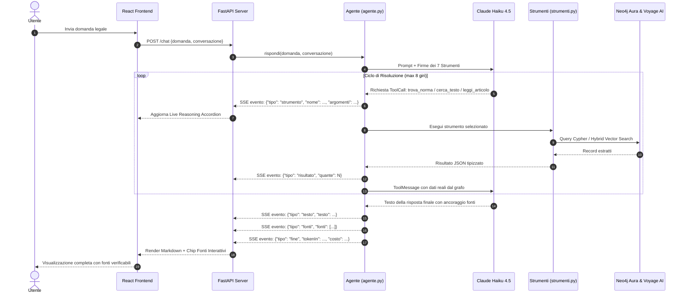
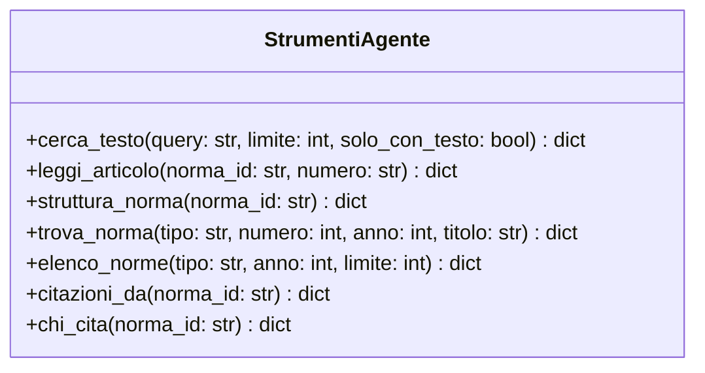
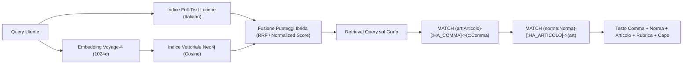
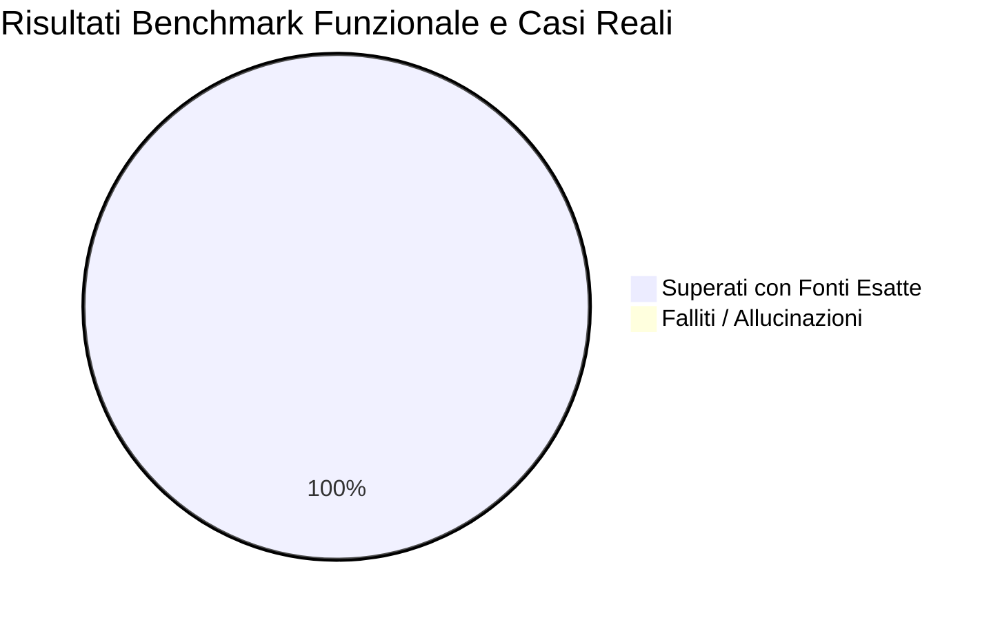

# Architettura dell'Agente e dell'Interfaccia

Agente conversazionale avanzato che risponde a quesiti sulla normativa della Repubblica di San Marino consultando il Knowledge Graph attraverso strumenti tipizzati e ricerca ibrida.

**Stato aggiornato:** operativo su **2.444 leggi con testo integrale**, **83.231 nodi** e **107.539 relazioni**.

---

## 1. Il Principio Fondamentale e Architettura di Sistema

### 1.1 Il Principio: Claude non parla direttamente con Neo4j

Non esiste alcuna connessione diretta fra il modello linguistico e il database. Claude:
* **Non ha credenziali di accesso** al database.
* **Non genera né esegue codice Cypher arbitrario** (evitando errori, injection o allucinazioni sintattiche).
* **Non vede lo schema grezzo del database.**

Il collegamento è un **ciclo asimmetrico e controllato** orchestrato interamente dal codice Python:
1. Il modello può solo **scegliere quale strumento tipizzato invocare** tra i 7 disponibili e passare argomenti validati.
2. Il codice Python esegue la funzione corrispondente con query Cypher pre-verificate e parametrizzate.
3. Il risultato viene restituito a Claude come `ToolMessage`.

### 1.2 Schema Architetturale Completo (Mermaid)

```mermaid
flowchart TB
    subgraph UI["1. Frontend Layer (React 18 + Vite + Tailwind)"]
        User(["👤 Utente"]) <-->|Interazione Chat| InputBar["Input Bar Flottante"]
        InputBar --> MessageList["Message List & Reasoning Accordion"]
        MessageList --> SourceModal["Source Modal (Testo Integrale Comma)"]
        Sidebar["Sidebar (Knowledge Graph Stats Live)"]
    end

    subgraph API["2. Backend Server (FastAPI + SSE Stream)"]
        InputBar -->|POST /chat (Streaming SSE)| ChatEndpoint["Endpoint /chat"]
        Sidebar -->|GET /stato (Polling / Metrics)| StatoEndpoint["Endpoint /stato"]
        ChatEndpoint -->|Generatore Eventi SSE| AgentEngine["LangChain 1.x Engine (agente.py)"]
        ChatEndpoint -.->|Flusso Testo & Eventi Token/Fonti| MessageList
    end

    subgraph Agent["3. AI Reasoning Layer (Anthropic Claude)"]
        AgentEngine <-->|Prompt di Sistema + Firme Tool| Claude["Claude 4.5 Haiku (claude-haiku-4-5)"]
        AgentEngine -->|Esecuzione Dispatcher| ToolBridge["Python Tool Bridge (strumenti.py)"]
    end

    subgraph Data["4. Knowledge & Vector Layer (Neo4j & Voyage AI)"]
        ToolBridge -->|7 Funzioni Tipizzate @tool| Tools["Registro Strumenti"]
        Tools -->|Query Cypher Parametrizzate| Neo4j[("Neo4j Aura Graph Database")]
        Tools -->|Query Vector Embeddings| Voyage["Voyage AI API (voyage-4 1024d)"]
        Voyage -.->|Vettore Similarità Cosina| Neo4j
        StatoEndpoint -->|Cache Query Conteggi| Neo4j
    end

    style User fill:#d4a359,stroke:#8a701a,stroke-width:2px,color:#000
    style Claude fill:#7fb2d4,stroke:#2b78b8,stroke-width:2px,color:#000
    style Neo4j fill:#008cc1,stroke:#005f87,stroke-width:2px,color:#fff
    style Voyage fill:#6366f1,stroke:#4338ca,stroke-width:2px,color:#fff
```

### 1.3 Lo Stack Tecnologico

| Componente | Scelta | Ruolo & Rationale |
|---|---|---|
| **Interfaccia Web** | **React 18 + Vite + Tailwind CSS** | UI in stile ChatGPT / Claude con accordion per il ragionamento, chip delle fonti e visualizzatore di norme. |
| **Server Web** | **FastAPI + Uvicorn** | Streaming SSE a bassissima latenza; la UI mostra in diretta quali strumenti vengono invocati. |
| **Orchestrazione Agente** | **LangChain 1.x (`create_agent`)** | Gestione del ciclo ReAct con memoria di sessione (`InMemorySaver`). |
| **Modello di Ragionamento (LLM)** | **Anthropic `claude-haiku-4-5`** | Bassa latenza, alta fedeltà alle istruzioni del prompt e costo contenuto ($1 / $5 MTok). |
| **Knowledge Graph** | **Neo4j Aura** | Grafo nativo con indici full-text Lucene e vincoli di unicità idempotenti. |
| **Modello di Embedding** | **Voyage AI (`voyage-4`)** | 1024 dimensioni, ottimizzato per lingua italiana e documenti ad alta densità legale. |

---

## 2. Il Ciclo di ReAct dell'Agente (Sequence Diagram)



---

## 3. Il Registro degli Strumenti (7 Typed Tools)

Il modello non esegue mai codice Cypher arbitrario: può esclusivamente invocare le 7 funzioni tipizzate:



| Strumento | Input Principali | Output Restituito | Uso Ottimale |
|---|---|---|---|
| **`cerca_testo`** | `query`, `limite` (default 8) | Commi pertinenti + metadati risaliti nel grafo | Ricerca tematica per concetti o parole chiave |
| **`leggi_articolo`** | `norma_id`, `numero` articolo | Testo integrale di tutti i commi dell'articolo | Lettura puntuale di disposizioni prima di citarle |
| **`struttura_norma`** | `norma_id` (es. `LQ-186-2005`) | Elenco completo di articoli, rubriche, capi | Panoramica e conteggio articoli in una sola chiamata |
| **`trova_norma`** | `tipo`, `numero`, `anno` o `titolo` | ID normativo e metadati della norma | Risoluzione rapida degli estremi normativi |
| **`elenco_norme`** | `tipo`, `anno`, `limite` (max 100) | Statistiche per tipologia + estratto leggi | Verifica copertura senza saturare il contesto |
| **`citazioni_da`** | `norma_id` | Norme richiamate (preambolo e articoli) | Analisi dei presupposti e rinvii di una legge |
| **`chi_cita`** | `norma_id` | Norme che rinviano a quella specificata | Analisi dell'impatto e della vigenza |

---

## 4. Ricerca Ibrida e Risalita del Contesto



> **Nota di Retrieval:** La **rubrica** è il titolo sintetico dell'articolo (es. `Art. 3 - (Fornitura degli strumenti di lavoro)`). La retrieval query risale istantaneamente la gerarchia: il modello non riceve mai un frammento anonimo, ma il testo del comma con la **rubrica dell'articolo** e il **Capo/Titolo** di appartenenza, garantendo una perfetta comprensione sistematica della norma.

---

## 5. Presidi Anti-Allucinazione e Benchmark

L'agente applica 3 presidi stringenti:
1. **Ancoraggio Obbligatorio:** ogni affermazione è vincolata a `norma`, `articolo` e `comma`.
2. **Dichiarazione di Mancanza:** se la materia non è presente a San Marino, l'agente lo dichiara esplicitamente senza ricorrere al diritto di altri stati.
3. **Distinzione Norme Stub:** dichiara apertamente se una norma citata non ha il testo caricato (`caricata: false`).

### Benchmark di Valutazione (5/5 Superati)



* **BENCH-01 (Struttura):** LQ 186/2005 sui Capitani Reggenti risolta in 7.3s tramite `struttura_norma`.
* **BENCH-02 (Precisione Testuale):** LC 1/2011 (Bandiera e Stemma) risolta in 4.5s con lettura integrale dell'art. 1.
* **BENCH-03 (Sintesi Tematica):** L. 202/2020 (Lavoro Agile) risolta in 19.7s con 30 commi ancorati.
* **BENCH-04 (Attraversamento Grafo):** LQ 184/2005 (Congresso di Stato) con estrazione delle basi costituzionali (`LC 183/2005`).
* **BENCH-05 (Negative Test):** Navi rompighiaccio in Artico con dichiarazione corretta di assenza di disciplina.
