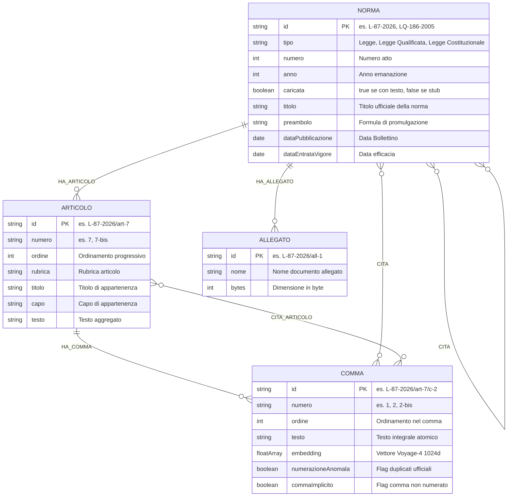
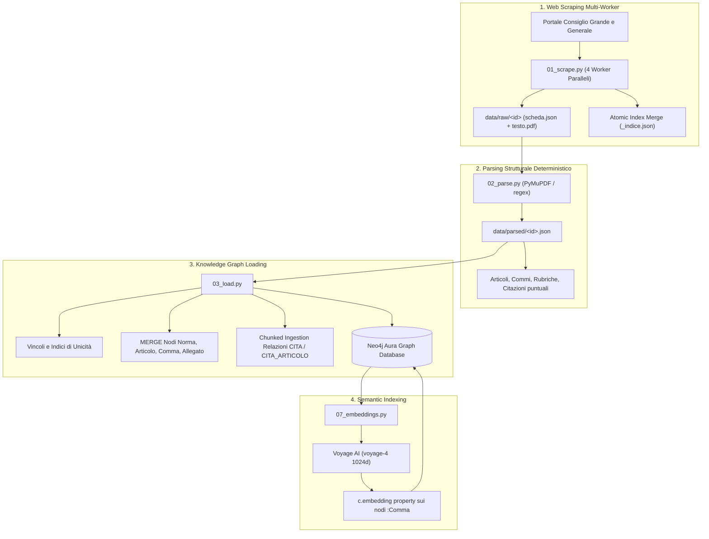

# Architettura del Knowledge Graph

Grafo Neo4j della normativa della Repubblica di San Marino, costruito per essere
interrogato da un agente in modalità Graph RAG.

**Stato aggiornato:** **83.231 nodi**, **107.539 relazioni**, **2.444 norme con testo integrale** (100% dell'archivio di Leggi, Leggi Qualificate e Costituzionali).

---

## 1. Modello Concettuale ed Entità

Un corpus normativo ha due strutture sovrapposte:
1. **Struttura Gerarchica:** `Norma ➔ Articolo ➔ Comma` (e allegati). Consente l'ancoraggio preciso e la risalita dal frammento al contesto normativo.
2. **Rete delle Citazioni e Rinvii:** collegamenti incrociati tra commi/norme ed altri atti richiamati (`CITA`, `CITA_ARTICOLO`).

### Schema Entità-Relazioni (Mermaid)



### 1.1 Cosa sono le "Rubriche" e perché sono fondamentali

Nel diritto e nella tecnica legislativa, la **rubrica** è il **titolo sintetico o intestazione che dà il nome a un articolo** (o a un Capo/Titolo), posto subito dopo il numero dell'articolo tra parentesi o in grassetto.

```text
Art. 4                              ◄─── Numero Articolo
(Incompatibilità con altre cariche) ◄─── RUBRICA DELL'ARTICOLO
1. La carica di Capitano Reggente...◄─── Testo del Comma 1
```

Nel nostro Knowledge Graph, le rubriche svolgono due funzioni cruciali:
1. **Navigazione dell'Indice in 1ms (`struttura_norma`):** l'agente riceve in una sola chiamata l'elenco di tutti gli articoli con le rispettive rubriche, individuando immediatamente l'articolo pertinente senza dover leggere l'intera legge.
2. **Doppia Indicizzazione Full-Text (`[n.testo, n.rubrica]`):** l'indice Lucene indicizza sia il corpo dei commi sia le rubriche degli articoli. Se un utente cerca un termine (es. *"Incompatibilità"* o *"Sanzioni"*), il sistema individua l'articolo anche se la parola chiave compare solo nel titolo dell'articolo e non nel corpo del comma.

---

## 2. Metriche e Consistenza del Grafo

| Entità / Label | Quantità | Ruolo nel Modello |
|---|---|---|
| **`:Comma`** | **`53.393`** | Unità atomica di testo, ricerca semantica e retrieval |
| **`:Articolo`** | **`25.803`** | Articoli con rubriche, capi e collocazione tematica |
| **`:Norma`** | **`3.650`** | Tutti gli atti normativi censiti: |
| ↳ *con testo integrale (`caricata: true`)* | *`2.444`* | *100% dell'archivio ufficiale delle Leggi, Costituzionali e Qualificate* |
| ↳ *stub citati (`caricata: false`)* | *`1.206`* | *Atti richiamati nei testi normativi per tracciare i rinvii* |
| **`:Allegato`** | **`385`** | Tabelle, cartografie e allegati normativi |
| **TOTALE NODI** | **`83.231`** | |

### Relazioni (Archi)

| Relazione | Quantità | Direzione | Significato |
|---|---|---|---|
| **`HA_COMMA`** | **`53.393`** | `Articolo ➔ Comma` | Contenimento strutturale |
| **`HA_ARTICOLO`** | **`25.803`** | `Norma ➔ Articolo` | Contenimento strutturale |
| **`CITA`** | **`21.341`** | `(Comma/Norma) ➔ Norma` | Rinvio normativo formale |
| **`CITA_ARTICOLO`** | **`6.617`** | `Comma ➔ Articolo` | Rinvio puntuale ad articolo specifico risolto |
| **`HA_ALLEGATO`** | **`385`** | `Norma ➔ Allegato` | Presenza di allegato tecnico |
| **TOTALE ARCHI** | **`107.539`** | | |

---

## 3. Pipeline di Acquisizione e Caricamento



---

## 4. Indici e Vincoli di Integrità

```cypher
-- Vincoli di unicità (idempotenza assoluta del caricamento)
CREATE CONSTRAINT norma_id    FOR (n:Norma)    REQUIRE n.id IS UNIQUE;
CREATE CONSTRAINT articolo_id FOR (a:Articolo) REQUIRE a.id IS UNIQUE;
CREATE CONSTRAINT comma_id    FOR (c:Comma)    REQUIRE c.id IS UNIQUE;
CREATE CONSTRAINT allegato_id FOR (x:Allegato) REQUIRE x.id IS UNIQUE;

-- Indici Full-Text per ricerca lessicale italiana
CREATE FULLTEXT INDEX testo_normativo FOR (n:Comma|Articolo) ON EACH [n.testo, n.rubrica]
  OPTIONS {indexConfig: {`fulltext.analyzer`: 'italian'}};
CREATE FULLTEXT INDEX titoli_norme FOR (n:Norma) ON EACH [n.titolo];

-- Indice Vettoriale per ricerca semantica ibrida
VECTOR INDEX commi_vettoriale FOR (c:Comma) ON c.embedding    -- 1024 dimensioni (cosine)
```

---

## 5. Riconciliazione delle Anomalie Giuridiche Reali

1. **Gestione Duplicate/Novelle (`numerazioneAnomala`):**
   * Alcune leggi storiche contengono commi con lo stesso numero o derivanti da novelle legislative (es. due commi 2 in un articolo). Il loader non sovrascrive né perde testo: aggiunge un suffisso deterministico (`/c-2`, `/c-2-2`) e applica il flag `numerazioneAnomala = true`.
2. **Commi Impliciti (`commaImplicito`):**
   * Per le leggi storiche antecedenti al 2000 prive di commi numerati, il testo dell'articolo viene conservato in un comma implicito marcato con `commaImplicito = true`.
3. **Gestione Multi-Label Idempotente:**
   * L'assegnazione delle etichette specializzate (`:LeggeQualificata`, `:LeggeCostituzionale`, `:DecretoLegge`) avviene dopo la creazione del nodo base `(:Norma {id: $id})` tramite istruzioni `SET`, evitando `ConstraintError` su nodi precedentemente creati come stub.
