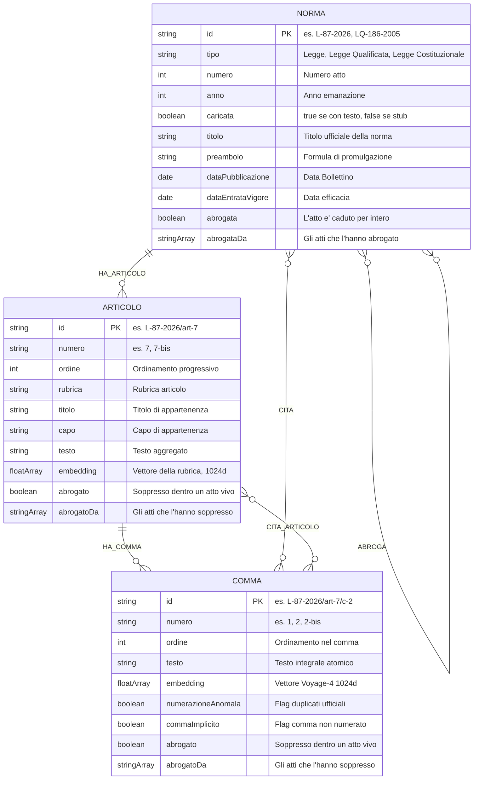
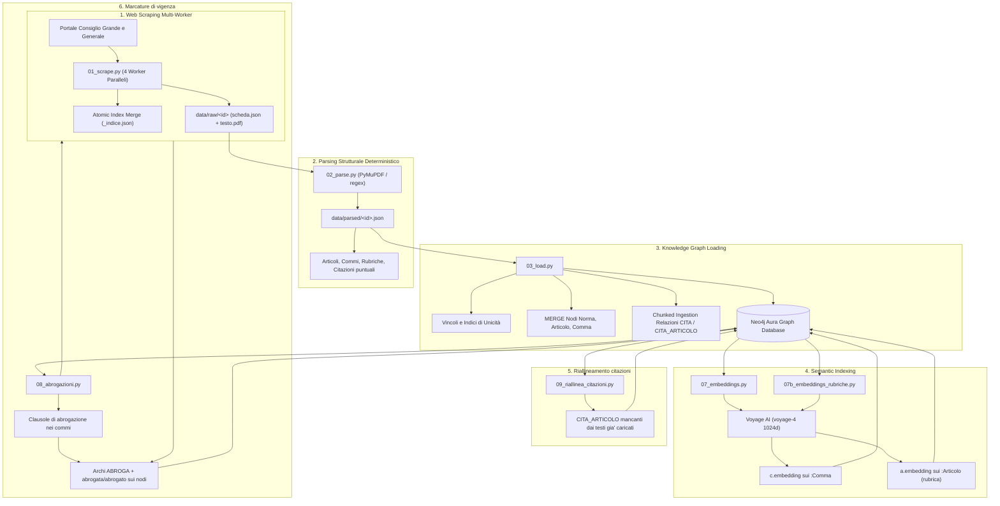

# Architettura del Knowledge Graph

Grafo Neo4j della normativa della Repubblica di San Marino, costruito per essere
interrogato da un agente in modalità Graph RAG.

**Stato aggiornato:** **268.238 nodi**, **350.069 relazioni**, **11.134 norme con testo
integrale** su 11.136 scaricabili dal portale, distribuite su 16 tipologie di atto:
leggi, decreti in tutte le loro forme, regolamenti, notifiche, ordinanze, statuti,
errata corrige e verbali. Tutti i 181.248 commi hanno un embedding, e 358 norme,
140 articoli e 52 commi portano una marcatura di abrogazione.

---

## 1. Modello Concettuale ed Entità

Un corpus normativo ha tre strutture sovrapposte:
1. **Struttura Gerarchica:** `Norma ➔ Articolo ➔ Comma`. Consente l'ancoraggio preciso e la risalita dal frammento al contesto normativo.
2. **Rete delle Citazioni e Rinvii:** collegamenti incrociati tra commi/norme ed altri atti richiamati (`CITA`, `CITA_ARTICOLO`).
3. **Vigenza:** quali atti, articoli e commi sono ancora diritto vivo (`ABROGA`, `abrogata`, `abrogato`). È la struttura più difficile da ricostruire e la più incompleta, perché **l'archivio non è consolidato**: conserva gli atti come furono pubblicati, e un articolo soppresso resta scritto per esteso, indistinguibile da uno vigente.

### Schema Entità-Relazioni (Mermaid)



### 1.1 Cosa sono le "Rubriche" e perché sono fondamentali

Nel diritto e nella tecnica legislativa, la **rubrica** è il **titolo sintetico o intestazione che dà il nome a un articolo** (o a un Capo/Titolo), posto subito dopo il numero dell'articolo tra parentesi o in grassetto.

```text
Art. 4                              ◄─── Numero Articolo
(Incompatibilità con altre cariche) ◄─── RUBRICA DELL'ARTICOLO
1. La carica di Capitano Reggente...◄─── Testo del Comma 1
```

Nel nostro Knowledge Graph, le rubriche svolgono due funzioni cruciali:
1. **Navigazione dell'Indice in 1ms (`struttura_norma`):** l'agente riceve in una sola chiamata l'elenco di tutti gli articoli con le rispettive rubriche, individuando immediatamente l'articolo pertinente senza dover leggere l'intera legge.
2. **Doppia Indicizzazione Full-Text (`[n.testo, n.rubrica]`):** l'indice Lucene indicizza sia il corpo dei commi sia le rubriche degli articoli. Se un utente cerca un termine (es. *"Incompatibilità"* o *"Sanzioni"*), il sistema individua l'articolo anche se la parola chiave compare solo nel titolo dell'articolo e non nel corpo del comma.

---

## 2. Metriche e Consistenza del Grafo

| Entità / Label | Quantità | Ruolo nel Modello |
|---|---|---|
| **`:Comma`** | **`182.264`** | Unità atomica di testo, ricerca semantica e retrieval |
| **`:Articolo`** | **`74.886`** | Articoli con rubriche, capi e collocazione tematica |
| **`:Norma`** | **`12.248`** | Tutti gli atti normativi censiti: |
| ↳ *con testo integrale (`caricata: true`)* | *`11.134`* | *Su 11.136 scaricabili dal portale, 16 tipologie* |
| ↳ *stub citati (`caricata: false`)* | *`1.114`* | *Atti richiamati nei testi per tracciare i rinvii* |
| **TOTALE NODI** | **`269.398`** | |

### Relazioni (Archi)

| Relazione | Quantità | Direzione | Significato |
|---|---|---|---|
| **`HA_COMMA`** | **`182.264`** | `Articolo ➔ Comma` | Contenimento strutturale |
| **`HA_ARTICOLO`** | **`74.886`** | `Norma ➔ Articolo` | Contenimento strutturale |
| **`CITA`** | **`69.662`** | `(Comma/Norma) ➔ Norma` | Rinvio normativo formale |
| **`CITA_ARTICOLO`** | **`24.493`** | `Comma ➔ Articolo` | Rinvio puntuale ad articolo specifico risolto |
| **`ABROGA`** | **`413`** | `Norma ➔ Norma` | Abrogazione di un atto per intero, riconosciuta senza ambiguità |
| **TOTALE ARCHI** | **`351.718`** | | |

`CITA_ARTICOLO` era fermo a 16.763 finche' `RE_BERSAGLIO`, nel parser,
pretendeva che il numero d'articolo fosse **adiacente** al nome dell'atto. Nel
linguaggio degli atti quasi mai lo e' — *«l'ultimo comma dell'art. 2 Cap. IV
della Legge n.38/1974»* — e il 6% delle citazioni nominava l'articolo senza che
venisse letto. Allargata l'espressione con una **lista bianca** di parole
strutturali (commi, capi, titoli, ordinali, numeri romani) invece di uno spazio
libero, che avrebbe agganciato l'articolo di una frase vicina. Le citazioni
risolte a livello d'articolo passano dal **32,4% al 46,1%**, e gli articoli con
una novella rilevabile sono 5.922.

Il guadagno vale per i caricamenti futuri; sul grafo esistente lo applica
`src/09_riallinea_citazioni.py`, che riusa le espressioni **importandole dal
parser** invece di ricopiarle — se divergessero, il grafo smetterebbe di
corrispondere a cio' che un caricamento pulito produrrebbe.

I `:Comma` erano 180.932 fino alla riparazione del parser: i **316 in più** sono
il testo che si perdeva su 312 articoli, dove il buffer della rubrica non si
chiudeva su `)` seguito da punteggiatura. Il conteggio dei nodi per etichetta
somma a 280.486 e non a 268.238 perché ogni `:Norma` ne porta due — quella
generica e quella del tipo (`:Legge`, `:DecretoDelegato`, e così via).

**I nodi `:Allegato` non ci sono più.** Erano 519 su 27 norme e portavano solo
`id`, nome del file e dimensione: nessun testo, nessun embedding, e nessuno
strumento dell'agente li leggeva. Non contribuivano ad alcuna risposta, e il
contenuto degli allegati resta raggiungibile dal PDF originale via
`/documenti/<id>`. L'elenco di cosa è stato rimosso è in
`out/allegati_rimossi.json`.

### Il testo coordinato: un atto che il grafo tiene aggiornato

L'archivio pubblica ogni atto **nella forma in cui è nato** e non lo riscrive
mai. Per il Codice Penale questo significava tenerne la versione del 1974 —
408 articoli, 408 commi tutti impliciti, **due** rubriche, quattro archi di
novella entranti — mentre cinquant'anni di modifiche non comparivano.

`src/10_codice_penale.py` integra il **testo coordinato** pubblicato dal
Consiglio Grande e Generale (`data/coordinati/codice-penale.pdf`, aggiornato al
27 febbraio 2026). Il Codice ha ora **480 articoli**, **916 commi** con i
capoversi al loro posto, **478 rubriche** e **303 archi di novella** entranti (le due schede comprese).

Come si legge il PDF, in breve:

  - **corpo e note si separano per dimensione del carattere** (11-12pt contro
    8pt), non per posizione nella pagina. Il richiamo di nota è uno span di
    sole cifre più piccolo *sulla stessa riga*, e va staccato: senza,
    `Art. 153` con la nota 43 diventa `Art. 15343`;
  - **i capoversi si riconoscono dal rientro** (x≈92 contro x≈57), corretto
    dalla punteggiatura di chi precede — negli articoli recenti anche le voci
    di un elenco rientrano, e l'elenco appartiene al comma che lo introduce;
  - le note portano, sotto *«Modifiche legislative»*, **l'atto e l'articolo**
    di ogni novella: è il dato che il parser dal testo degli atti modificanti
    non sa ricavare.

Il testo del 1974 resta in **`Articolo.testoOriginario`** per i 408 articoli
che lo avevano; `Articolo.fonteTesto` e `Articolo.testoAggiornatoAl` dicono da
dove viene il testo vigente e a quando è aggiornato.

Due vincoli di proprietà, entrambi per non rompere l'idempotenza altrui:

  - **le marcature di vigenza non si scrivono qui.** `08_abrogazioni.py` le
    azzera e riscrive a ogni esecuzione; questo script deposita le evidenze in
    `data/derivato/abrogazioni_*.json` e `08` le legge insieme alle proprie;
  - **gli archi di novella portano `origine`** e vengono cancellati e riscritti
    a ogni giro, così una modifica che smette di essere riconosciuta non lascia
    dietro di sé l'arco della volta prima. Gli archi che il parser ricava dal
    testo degli atti non hanno quella marca e restano dove sono.

Il portale ha **due schede** per il Codice Penale e il caricamento le tiene
entrambe, qualificando la seconda con il proprio `schedaId`: sono lo stesso
atto, e lo script scrive su tutte, altrimenti l'agente ne trova due versioni in
disaccordo.

Gli archi di novella comprendono anche **l'atto che ha introdotto** ciascun
articolo, non solo quelli che l'hanno modificato. Non e' un dettaglio: l'atto
introduttivo riporta il testo dell'articolo per intero, quindi la ricerca lo
trova li', e senza quell'arco non c'e' modo di risalire all'articolo del Codice
dove sta la marcatura di abrogazione. E' il caso dell'art. 282-bis, introdotto
dalla `L-101/2003` e abrogato dalla `L-59/2025`: `_bersagli_abrogati()` in
`strumenti.py` segue l'arco e lo dichiara.

Vale per **un atto su 7.800**: i commi impliciti scendono da 46.800 a 46.392.
Il metodo però è riusabile su qualunque altro testo coordinato.

### Marcature di vigenza

Non sono relazioni ma proprietà sui nodi, ed è una scelta: la lettura le trova
sul nodo che ha già in mano, senza un `MATCH` in più su ogni ricerca.

| Proprietà | Su | Quantità | Significato |
|---|---|---:|---|
| `Norma.abrogata` / `abrogataDa` | `:Norma` | **358** | L'atto è caduto per intero |
| `Articolo.abrogato` / `abrogatoDa` | `:Articolo` | **118** | Articolo soppresso dentro un atto vivo |
| `Comma.abrogato` / `abrogatoDa` | `:Comma` | **52** | Comma soppresso dentro un atto vivo |

Le si ricalcola da zero a ogni esecuzione di `src/08_abrogazioni.py --scrivi`,
archi `ABROGA` compresi: senza cancellarli prima, un arco che smette di essere
riconosciuto sopravvive alla correzione del filtro che lo escludeva.

#### `ABROGA`, e perché copre meno di quanto sembri

Nel corpus ci sono **1.728 commi** che contengono «è abrogato», «sono abrogati»
o «e' abrogato», e se ne modellano 413. Non è una svista: la forma più comune
abroga una **parte** — *«All'articolo 2 della Legge n.55/1994, il punto 8.0 è
abrogato»* — e leggerla come abrogazione dell'articolo 2 dichiarerebbe morta
una norma viva. In un archivio che deve dire a un cittadino se ha diritto a
qualcosa, quello è l'errore peggiore disponibile: gli errori di omissione
lasciano l'utente dov'era, questo gli nega un diritto che ha.

Da qui il principio che governa tutto il riconoscimento: **la certezza vale più
della copertura**. Ogni forma ambigua si scarta, e ogni forma nuova si rilegge a
mano prima di scrivere — è così che sono stati trovati tutti i falsi positivi
elencati più sotto, nessuno dei quali era stato colto dalle prove automatiche.

Si riconoscono perciò le sole forme che colpiscono un **atto intero** — `È
abrogata la Legge 27 ottobre 2004 n. 146`, `La Legge n.146/2004 è abrogata`,
`Sono abrogate la Legge n.97/1989 e la Legge n.99/1991` — scartando parti
d'atto, decorrenze differite a date future e clausole di salvezza. Il
riconoscimento porta le proprie prove in `src/08_abrogazioni.py`: se una
fallisce, lo script esce senza scrivere.

La marcatura effettiva non viene solo da lì. L'archivio di Stato segna da sé
gli atti caduti premettendo `ABROGATO - ` al titolo — **125 norme** — e i due
segnali si sovrappongono per **88 norme** — ed è una conferma reciproca, non una
ridondanza: il titolo dice *che* un atto è caduto, i commi dicono *da chi*.
L'unione marca **358 norme** con `Norma.abrogata`, e le 321 con attribuzione
nota portano anche `Norma.abrogataDa`.

#### Le trappole, in ordine di quanto sono costate

Nessuna di queste e' stata trovata dalle prove automatiche: le ha trovate tutte
la rilettura a mano di cio' che ogni forma nuova aggiungeva. E' la ragione per
cui quel passo non si salta.

| Trappola | Costo | Cosa insegna |
|---|---|---|
| **La salvezza degli effetti** — *«e' abrogato il DD n.199/2024. Sono fatti salvi gli atti e gli effetti»* | 117 clausole scartate a torto | Non tutte le salvezze sono uguali: preservare gli **effetti gia' prodotti** non tiene in vita l'atto, preservare una **disposizione** si'. Le trattavo allo stesso modo |
| **L'apostrofo tipografico** — `E' ` e `E’ ` accanto a `E` | 412 commi su 1.728 mai esaminati | Fra i perduti c'era la L-145/2022 che abroga la L-106/2009: l'agente indicava come successore la L-107/2009, un atto **anteriore** su altra materia |
| **L'arco come punto di partenza** | 124 articoli su 173 | `CITA_ARTICOLO` esiste per i riferimenti puntuali, non per ogni voce di un elenco |
| **La partizione in testa a un elenco** — *«le disposizioni della Legge n.9/1960, della Legge n.24/1972»* | falsi positivi su leggi vive | La parola che delimita il bersaglio compare una volta e governa tutto il seguito: la seconda legge ha davanti un innocuo `, della ` |
| **La clausola di esclusione** — *«ad esclusione dell'articolo 6»* | 5 leggi vive dichiarate morte | Segue il bersaglio invece di precederlo, e in un elenco appartiene alla sola voce che la porta |
| **L'accento combinante** — `e`+U+0300 invece di `è` | candidati da 1.728 a 1.114 | Un dettaglio di codifica puo' dimezzare il recall **senza che nulla segnali un errore** |
| **L'atto modificante** — *«la Legge n.76/1976 — modificata con Legge n.14/1982 — e' abrogata»* | 1 legge viva | L'atto nominato per dire *come* il bersaglio era stato modificato non e' esso stesso un bersaglio |
| **La riscrittura sul posto** — *«e' abrogato e cosi' sostituito: "…"»* | 1 | L'atto non muore, cambia contenuto. Diverso da *«abrogato e sostituito dal presente Decreto»*, dove a sostituirlo e' un altro atto |
| **L'ultrattivita'** — *«e' abrogato … le disposizioni continuano ad avere applicazione»* | 1 | Abrogato ma ancora applicabile: dirlo morto e basta inganna |
| **Il confine di frase** — *«…e successive modifiche. 3 bis. E' abrogato…»* | 1 | Il divario fra bersaglio e verbo non deve scavalcare un punto seguito da maiuscola o da un capoverso numerato |
| **Il tipo dell'atto** | 1 | Va confrontato col **prefisso dell'id**, non con `Norma.tipo`, che e' scritto a mano e contiene *Decreto Delagato*, *Decreto Delega5to*, *Decreto Conisliare* |
| **L'abbreviazione** — `art.` e `artt.` | alcuni | Gli atti abbreviano piu' spesso di quanto scrivano per esteso |

Un falso allarme merita di stare nell'elenco quanto le trappole vere: quattro
coppie sembravano sbagliate perche' la finestra di stampa mostrava la clausola
**sbagliata** di un comma che ne conteneva due. Il campione va sempre letto
sulla porzione che ha prodotto l'aggancio, non sull'inizio del testo.

#### Il livello parziale: `Articolo.abrogato` e `Comma.abrogato`

Un articolo o un comma soppressi dentro una legge che per il resto vige sono il
caso più frequente e il più insidioso: l'atto risulta in vigore, il testo del
passo si legge intero e sensato, e **nulla in esso avverte che non vale più**.
L'archivio di Stato conserva gli atti come furono pubblicati e non li riscrive —
non è un testo consolidato — quindi in un testo vigente quell'articolo direbbe
«(Abrogato)», qui invece resta scritto per esteso. Verificato: su 74.742
articoli, **uno solo** ha la rubrica `(Abrogato)`.

Il bersaglio si risolve dal testo. Il primo tentativo si appoggiava all'arco
`CITA_ARTICOLO` già presente nel grafo, ma quello esiste per i riferimenti
puntuali e **non per ogni voce di un elenco**: *«sono abrogati gli articoli 1,
3, 11, 12 e 13 della Legge n.97/1997»* non ne produce uno per voce, e
dipenderne costava **124 articoli su 173**.

Ciò che l'arco garantiva lo garantiscono quattro controlli in fila: tipo
concorde col prefisso dell'id, atto che risolve a **una** sola norma, bersaglio
non posteriore alla fonte, e partizione che esiste davvero dentro quell'atto —
se il testo dice «comma 7» e l'articolo ne ha sei, il riferimento è stato letto
male. Si marcano così **140 articoli** e **52 commi**, con `abrogato` e
`abrogatoDa`, esposti al modello come `passoAbrogato`.

Il numero resta limitato perché la maggioranza delle clausole scende ancora più
in basso, sotto il livello che il grafo modella. Due trappole specifiche di
questo livello: *«è abrogato **e sostituito** dal seguente»* non è
un'abrogazione ma una novella — l'articolo resta, riscritto — e il divario fra
«articolo N» e «è abrogato» non deve **scavalcare un confine di frase**, perché
in *«…della Legge n.40/2014 e successive modifiche. 3 bis. E' abrogato…»*
l'espressione agganciava un verbo che apparteneva alla frase seguente.

**Il rischio non è l'arco sbagliato, è l'arco assente.** Il marchio copre il
**2,9%** delle norme, e il **43,1%** delle clausole di abrogazione produce una
marcatura: l'assenza non dimostra nulla, ma un indice rado invita a leggerla
come conferma di vigenza. Perciò il campo entra nel prompt come avviso
esclusivamente positivo: la presenza autorizza «è stata abrogata», l'assenza
non autorizza «risulta vigente», e le istruzioni lo vietano espressamente.

Il limite residuo è noto e non risolto: la regola si allenta quando l'agente
trova prove indirette. Richiesto se la L. 47/2006 sia in vigore, ha risposto
«sì» appoggiandosi al fatto di averne trovato novelle fino al 2023 — prova che
l'atto era vivo nel 2023, non che non sia caduto dopo.

#### Cosa `ABROGA` non copre, che è la parte più grande

Non si scandagliano le 12.248 norme chiedendosi per ciascuna se sia caduta:
l'informazione non sta nella norma morta, sta nell'atto che l'ha uccisa. Restano
fuori, in ordine di frequenza:

| Non coperto | Perché |
|---|---|
| **Forme illeggibili** — 408 commi su 1.728 | Bersagli impliciti, rinvii a «norme in contrasto», elenchi non strutturati |
| **Partizioni sotto il comma** — «la lettera d), comma 1, dell'articolo 3» | Il grafo non modella lettere e punti: non c'è nodo da marcare |
| **Abrogazione tacita** — una legge posteriore incompatibile con una anteriore, senza dirlo | Nessun metodo testuale può trovarla |

I **commi ordinali** meritano una riga a parte, perché sembrano recuperabili e
non lo sono. La famiglia più grande fra le clausole non lette — 116 casi —
scrive il comma in lettere: *«il **secondo** ed il **terzo** comma dell'art.
13»*. Riconoscerla è facile, ed è stato provato. Ha prodotto **zero copertura**:
per le leggi antiche il parser mette l'intero articolo in **un solo comma
implicito** numerato «1» — 46.800 commi impliciti su 181.248 — quindi il
«secondo comma» non esiste come nodo e non c'è nulla da marcare. Su 16
riferimenti estratti, uno solo risolveva. **Il muro è il parser, non il
riconoscimento**, e finché non divide i commi delle leggi antiche qualunque
lavoro su questa famiglia è sprecato.

---

## 3. Pipeline di Acquisizione e Caricamento



I passi 4, 5 e 6 sono **idempotenti e rieseguibili**: il 07 e il 07b calcolano
solo ciò che manca, il 09 usa `MERGE` e non duplica, l'08 azzera e riscrive da
capo le proprie marcature. Vanno
rilanciati dopo ogni caricamento — un comma senza embedding è quasi invisibile
alla ricerca (§4.5), e un atto abrogato non marcato è indistinguibile da uno
vigente.

---

## 4. Gli Embedding: dove stanno e a cosa servono

### 4.1 Il problema che risolvono

L'indice full-text pesa le **parole**, non il **significato**. Un cittadino non
scrive «soggiorno culturale per giovani cittadini sammarinesi residenti
all'estero»: scrive «vacanza studio per figli di emigrati che vogliono imparare
la lingua». Le due frasi non condividono quasi nessuna parola, e per Lucene sono
estranee.

Gli embedding trasformano ogni testo in **1024 numeri**, disposti in modo che
frasi con lo stesso significato finiscano vicine nello spazio. Misurato sulle
frasi qui sopra:

| Confronto | Somiglianza coseno |
|---|---:|
| «soggiorno culturale... residenti all'estero» ⟷ «vacanza studio... figli di emigrati» | **0,778** |
| «soggiorno culturale... residenti all'estero» ⟷ «aliquote IGR e detrazioni» | 0,494 |

Nessuna parola in comune, ma i numeri sanno che parlano della stessa cosa.

### 4.2 Chi fa cosa

Tre componenti distinti, che non si parlano mai fra loro:

| Componente | Compito | Cosa NON fa |
|---|---|---|
| **Voyage AI** (`voyage-4`) | trasforma testo in 1024 numeri | non capisce di diritto, non scrive nulla, non vede mai la risposta |
| **Neo4j** | conserva quei numeri e trova i più vicini | non genera testo |
| **Claude** | legge i commi ripescati e scrive la risposta con le citazioni | non vede mai un vettore |

Anthropic non offre un'API di embedding, e non è una lacuna: comprimere un
significato in un punto dello spazio e ragionare su un testo sono due mestieri
diversi.

### 4.3 Dove risiedono fisicamente

**Dentro Neo4j, come proprietà dei nodi stessi.** Non esiste un archivio
vettoriale separato:

```
Comma.embedding      1024 float per comma      es. L-101-2025/art-1/c-1
181.248 commi        ~0,69 GB nell'istanza Aura

Articolo.embedding   1024 float per rubrica     es. L-101-2025/art-1
35.422 articoli      ~0,14 GB, vedi 5.1
```

`07_embeddings.py` usa `from_existing_graph`: aggiunge la proprietà ai nodi
`:Comma` che già esistono, invece di duplicare i testi altrove. **Il grafo resta
uno solo.**

È questa scelta a rendere possibile la `retrieval_query` di `strumenti.py`, che
gira *dopo* il match vettoriale con `node` e `score` già disponibili e da lì
risale comma → articolo → norma. Ricerca semantica e navigazione del grafo
diventano **una query sola**. Con un database vettoriale separato servirebbero
due sistemi da tenere allineati, e ogni ricerca sarebbe due viaggi di rete.

### 4.4 Quando Voyage viene chiamato

Due momenti, di costo incomparabile:

| Momento | Volume | Costo | Frequenza |
|---|---|---|---|
| **Indicizzazione del corpus** | 17,8 M token per 181.248 commi | ~1,07 $ | una volta, poi solo per gli atti nuovi |
| **Ogni interrogazione** | ~20 token (la domanda) | frazioni di millesimo | a ogni `cerca_testo` |

L'ultima indicizzazione completa ha richiesto **97 minuti** per 128.613 commi.
L'account dispone di 200 milioni di token gratuiti sulla generazione 4, quindi
in pratica il costo è nullo.

### 4.5 Due trappole

**`voyage-law-2` non va usato.** Il nome promette il dominio giuridico, ma il
modello non è multilingue e su testi italiani rende meno di `voyage-4`, che è
generalista. È annotato anche in `07_embeddings.py`.

**Un comma senza embedding è quasi invisibile.** Non è semplicemente «meno
trovabile»: competendo solo sul ramo lessicale contro 181.000 altri commi, perde
sistematicamente contro documenti più lunghi che ripetono le stesse parole.
Verificato sul campo: prima dell'indicizzazione il Regolamento 10/2026 non usciva
nei primi risultati **nemmeno interrogandolo con le sue stesse parole**. Dopo,
compare in terza posizione. Per questo `07_embeddings.py` va rieseguito dopo ogni
caricamento: è idempotente e calcola solo i commi che non ce l'hanno.

---

## 5. Indici e Vincoli di Integrità

```cypher
-- Vincoli di unicità (idempotenza assoluta del caricamento)
CREATE CONSTRAINT norma_id    FOR (n:Norma)    REQUIRE n.id IS UNIQUE;
CREATE CONSTRAINT articolo_id FOR (a:Articolo) REQUIRE a.id IS UNIQUE;
CREATE CONSTRAINT comma_id    FOR (c:Comma)    REQUIRE c.id IS UNIQUE;

-- Indici Full-Text per ricerca lessicale italiana
CREATE FULLTEXT INDEX testo_normativo FOR (n:Comma|Articolo) ON EACH [n.testo, n.rubrica]
  OPTIONS {indexConfig: {`fulltext.analyzer`: 'italian'}};
CREATE FULLTEXT INDEX titoli_norme FOR (n:Norma) ON EACH [n.titolo];

-- Indici Vettoriali per la ricerca semantica: uno sui commi, uno sulle
-- rubriche degli articoli. Sono due perche' rispondono a domande diverse -
-- vedi 5.1 - e la ricerca li interroga entrambi con UN SOLO embedding della
-- domanda, per non pagare Voyage due volte.
VECTOR INDEX commi_vettoriale    FOR (c:Comma)    ON c.embedding
VECTOR INDEX rubriche_vettoriale FOR (a:Articolo) ON a.embedding
-- configurazione effettiva in esercizio:
--   vector.dimensions           1024
--   vector.similarity_function  COSINE
--   vector.hnsw.m               16
--   vector.hnsw.ef_construction 100
--   vector.quantization.type    SCALAR   comprime i vettori in memoria: ricerca
--                                        piu' leggera, perdita di precisione
--                                        trascurabile su 181.000 commi
```

### 5.1 I tre indici non coprono le stesse cose

E' un'asimmetria voluta, ma va conosciuta perche' condiziona chi legge i
risultati. Il primo e' lessicale, gli altri due semantici:

| | `testo_normativo` (Lucene) | `commi_vettoriale` | `rubriche_vettoriale` |
|---|---|---|---|
| etichette | `Comma` **e** `Articolo` | `Comma` | `Articolo` |
| proprieta' | `testo` e `rubrica` | `embedding` | `embedding` |
| cosa vettorializza | - | il testo del comma | titolo della norma + rubrica |
| trova per | parole esatte, flesse dall'analizzatore italiano | significato del contenuto | significato dell'argomento |

Un `:Articolo` ha un embedding **della propria rubrica**, non dei suoi commi: la
rubrica dice di cosa tratta l'articolo, i commi dicono cosa dispone.

Si vettorializza `titolo della norma + rubrica`, non la rubrica nuda: le rubriche
sono spesso una parola sola - «Destinatari», «Sanzioni», «Definizioni» - e da
sole darebbero un vettore ambiguo. Con il titolo davanti si collocano, che e'
anche il modo in cui un giurista le legge. Il testo dell'articolo non entra: e'
gia' coperto dagli embedding dei suoi commi.

Costo: 35.713 rubriche, ~425.000 token, **$0,025** con voyage-4, e ~140 MB in
piu' su Aura. Lo calcola `07b_embeddings_rubriche.py`, idempotente come il 07 e
da rieseguire insieme a quello dopo ogni caricamento.

**Prima che esistesse il terzo indice**, un `:Articolo` poteva entrare nei
risultati solo dal ramo lessicale, e questo imponeva un compromesso nella
fusione: alzando il peso lessicale si trovavano le rubriche ma tornavano i
risultati fuori tema agganciati da una parola comune. Il terzo indice ha tolto
il compromesso - vedi §4.2 dell'architettura dell'agente.

Le rubriche restano indicizzate perche' sono la riga piu' densa di senso di un
articolo (`(Incompatibilita' con altre cariche)`, `(Morte dell'assegnatario)`):
spesso dicono in cinque parole cio' che il comma dice in trecento.

Questa asimmetria ha prodotto il difetto di recupero piu' costoso del sistema.
La query di risalita apriva con `MATCH (art:Articolo)-[:HA_COMMA]->(node)`
obbligatorio: corretto per un `Comma`, ma su un nodo `:Articolo` non ha alcun
risultato, e quel nodo spariva dai risultati **senza errore**, proprio mentre
l'indice l'aveva classificato per primo. Corretto con `OPTIONAL MATCH` e
`coalesce` — vedi §4.1 dell'architettura dell'agente.

**Regola per chi scrive query su `testo_normativo`: non dare per scontato che
`node` sia un `Comma`.** Vale anche per le query diagnostiche in
`04_verify.cypher`.

---

## 6. Riconciliazione delle Anomalie Giuridiche Reali

1. **Gestione Duplicate/Novelle (`numerazioneAnomala`):**
   * Alcune leggi storiche contengono commi con lo stesso numero o derivanti da novelle legislative (es. due commi 2 in un articolo). Il loader non sovrascrive né perde testo: aggiunge un suffisso deterministico (`/c-2`, `/c-2-2`) e applica il flag `numerazioneAnomala = true`.
2. **Commi Impliciti (`commaImplicito`):**
   * Per le leggi storiche antecedenti al 2000 prive di commi numerati, il testo dell'articolo viene conservato in un comma implicito marcato con `commaImplicito = true`.
3. **Gestione Multi-Label Idempotente:**
   * L'assegnazione delle etichette specializzate (`:LeggeQualificata`, `:LeggeCostituzionale`, `:DecretoLegge`) avviene dopo la creazione del nodo base `(:Norma {id: $id})` tramite istruzioni `SET`, evitando `ConstraintError` su nodi precedentemente creati come stub.
4. **Decreti e loro ratifiche:**
   * Un decreto viene ratificato entro tre mesi da un decreto di ratifica che ne riproduce il testo. In archivio sono due norme distinte con lo stesso contenuto, e la stessa clausola di abrogazione compare quindi due volte: gli archi sono corretti in entrambi e puntano allo stesso bersaglio. Non è duplicazione del corpus, è il funzionamento dell'ordinamento.
5. **Id qualificati per collisione (`~`):**
   * Alcune norme portano un id con suffisso, es. `L-42-2010~17017141`. Sono atti distinti che collidevano sulla chiave naturale; vanno trattati come qualsiasi altra norma.
6. **Sotto-commi fusi:**
   * Le partizioni «1 bis», «1 ter», «1 quater» finiscono in un solo nodo `:Comma` insieme al comma 1. È la ragione per cui una clausola che abroga «il comma 7» può non trovare il comma corrispondente, e in quel caso non si marca nulla.
