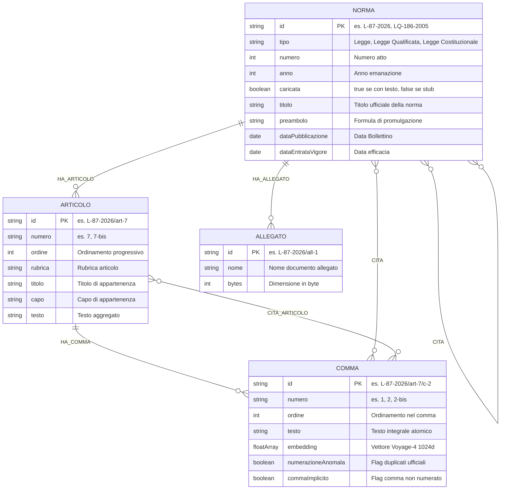
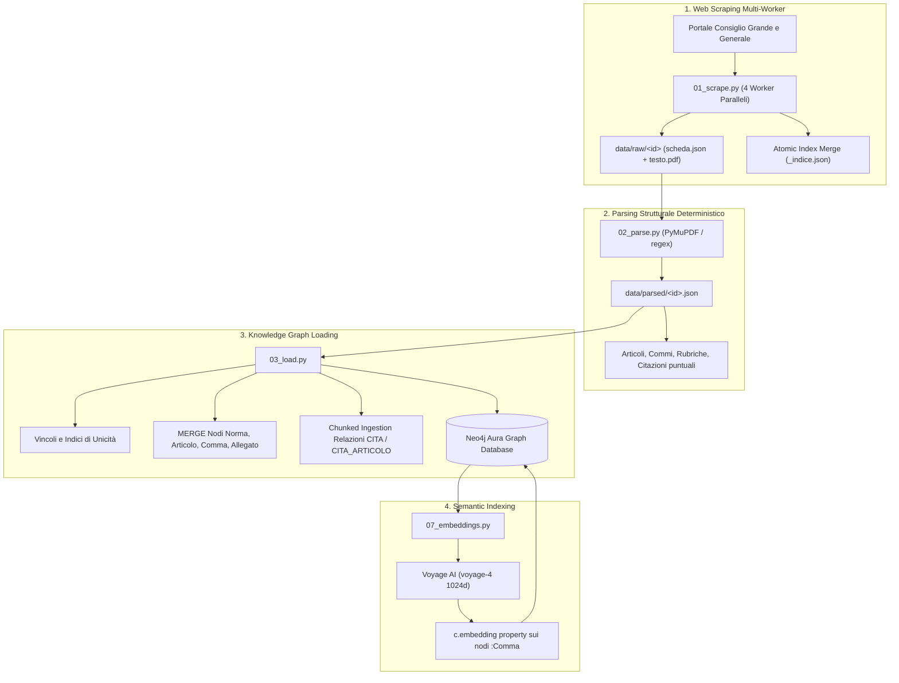

# Architettura del Knowledge Graph

Grafo Neo4j della normativa della Repubblica di San Marino, costruito per essere
interrogato da un agente in modalità Graph RAG.

**Stato aggiornato:** **268.441 nodi**, **342.618 relazioni**, **11.134 norme con testo
integrale** su 11.136 scaricabili dal portale, distribuite su 16 tipologie di atto:
leggi, decreti in tutte le loro forme, regolamenti, notifiche, ordinanze, statuti,
errata corrige e verbali. Tutti i 180.932 commi hanno un embedding.

---

## 1. Modello Concettuale ed Entità

Un corpus normativo ha due strutture sovrapposte:
1. **Struttura Gerarchica:** `Norma ➔ Articolo ➔ Comma` (e allegati). Consente l'ancoraggio preciso e la risalita dal frammento al contesto normativo.
2. **Rete delle Citazioni e Rinvii:** collegamenti incrociati tra commi/norme ed altri atti richiamati (`CITA`, `CITA_ARTICOLO`).

### Schema Entità-Relazioni (Mermaid)



### 1.1 Cosa sono le "Rubriche" e perché sono fondamentali

Nel diritto e nella tecnica legislativa, la **rubrica** è il **titolo sintetico o intestazione che dà il nome a un articolo** (o a un Capo/Titolo), posto subito dopo il numero dell'articolo tra parentesi o in grassetto.

```text
Art. 4                              ◄─── Numero Articolo
(Incompatibilità con altre cariche) ◄─── RUBRICA DELL'ARTICOLO
1. La carica di Capitano Reggente...◄─── Testo del Comma 1
```

Nel nostro Knowledge Graph, le rubriche svolgono due funzioni cruciali:
1. **Navigazione dell'Indice in 1ms (`struttura_norma`):** l'agente riceve in una sola chiamata l'elenco di tutti gli articoli con le rispettive rubriche, individuando immediatamente l'articolo pertinente senza dover leggere l'intera legge.
2. **Doppia Indicizzazione Full-Text (`[n.testo, n.rubrica]`):** l'indice Lucene indicizza sia il corpo dei commi sia le rubriche degli articoli. Se un utente cerca un termine (es. *"Incompatibilità"* o *"Sanzioni"*), il sistema individua l'articolo anche se la parola chiave compare solo nel titolo dell'articolo e non nel corpo del comma.

---

## 2. Metriche e Consistenza del Grafo

| Entità / Label | Quantità | Ruolo nel Modello |
|---|---|---|
| **`:Comma`** | **`180.932`** | Unità atomica di testo, ricerca semantica e retrieval |
| **`:Articolo`** | **`74.742`** | Articoli con rubriche, capi e collocazione tematica |
| **`:Norma`** | **`12.248`** | Tutti gli atti normativi censiti: |
| ↳ *con testo integrale (`caricata: true`)* | *`11.134`* | *Su 11.136 scaricabili dal portale, 16 tipologie* |
| ↳ *stub citati (`caricata: false`)* | *`1.114`* | *Atti richiamati nei testi per tracciare i rinvii* |
| **`:Allegato`** | **`519`** | Tabelle, cartografie e allegati normativi |
| **TOTALE NODI** | **`268.441`** | |

### Relazioni (Archi)

| Relazione | Quantità | Direzione | Significato |
|---|---|---|---|
| **`HA_COMMA`** | **`180.932`** | `Articolo ➔ Comma` | Contenimento strutturale |
| **`HA_ARTICOLO`** | **`74.742`** | `Norma ➔ Articolo` | Contenimento strutturale |
| **`CITA`** | **`69.662`** | `(Comma/Norma) ➔ Norma` | Rinvio normativo formale |
| **`CITA_ARTICOLO`** | **`16.763`** | `Comma ➔ Articolo` | Rinvio puntuale ad articolo specifico risolto |
| **`HA_ALLEGATO`** | **`519`** | `Norma ➔ Allegato` | Presenza di allegato tecnico |
| **TOTALE ARCHI** | **`342.618`** | | |

---

## 3. Pipeline di Acquisizione e Caricamento



---

## 4. Gli Embedding: dove stanno e a cosa servono

### 4.1 Il problema che risolvono

L'indice full-text pesa le **parole**, non il **significato**. Un cittadino non
scrive «soggiorno culturale per giovani cittadini sammarinesi residenti
all'estero»: scrive «vacanza studio per figli di emigrati che vogliono imparare
la lingua». Le due frasi non condividono quasi nessuna parola, e per Lucene sono
estranee.

Gli embedding trasformano ogni testo in **1024 numeri**, disposti in modo che
frasi con lo stesso significato finiscano vicine nello spazio. Misurato sulle
frasi qui sopra:

| Confronto | Somiglianza coseno |
|---|---:|
| «soggiorno culturale... residenti all'estero» ⟷ «vacanza studio... figli di emigrati» | **0,778** |
| «soggiorno culturale... residenti all'estero» ⟷ «aliquote IGR e detrazioni» | 0,494 |

Nessuna parola in comune, ma i numeri sanno che parlano della stessa cosa.

### 4.2 Chi fa cosa

Tre componenti distinti, che non si parlano mai fra loro:

| Componente | Compito | Cosa NON fa |
|---|---|---|
| **Voyage AI** (`voyage-4`) | trasforma testo in 1024 numeri | non capisce di diritto, non scrive nulla, non vede mai la risposta |
| **Neo4j** | conserva quei numeri e trova i più vicini | non genera testo |
| **Claude** | legge i commi ripescati e scrive la risposta con le citazioni | non vede mai un vettore |

Anthropic non offre un'API di embedding, e non è una lacuna: comprimere un
significato in un punto dello spazio e ragionare su un testo sono due mestieri
diversi.

### 4.3 Dove risiedono fisicamente

**Dentro Neo4j, come proprietà dei nodi stessi.** Non esiste un archivio
vettoriale separato:

```
Comma.embedding      1024 float per comma      es. L-101-2025/art-1/c-1
180.932 commi        ~0,69 GB nell'istanza Aura
```

`07_embeddings.py` usa `from_existing_graph`: aggiunge la proprietà ai nodi
`:Comma` che già esistono, invece di duplicare i testi altrove. **Il grafo resta
uno solo.**

È questa scelta a rendere possibile la `retrieval_query` di `strumenti.py`, che
gira *dopo* il match vettoriale con `node` e `score` già disponibili e da lì
risale comma → articolo → norma. Ricerca semantica e navigazione del grafo
diventano **una query sola**. Con un database vettoriale separato servirebbero
due sistemi da tenere allineati, e ogni ricerca sarebbe due viaggi di rete.

### 4.4 Quando Voyage viene chiamato

Due momenti, di costo incomparabile:

| Momento | Volume | Costo | Frequenza |
|---|---|---|---|
| **Indicizzazione del corpus** | 17,8 M token per 180.932 commi | ~1,07 $ | una volta, poi solo per gli atti nuovi |
| **Ogni interrogazione** | ~20 token (la domanda) | frazioni di millesimo | a ogni `cerca_testo` |

L'ultima indicizzazione completa ha richiesto **97 minuti** per 128.613 commi.
L'account dispone di 200 milioni di token gratuiti sulla generazione 4, quindi
in pratica il costo è nullo.

### 4.5 Due trappole

**`voyage-law-2` non va usato.** Il nome promette il dominio giuridico, ma il
modello non è multilingue e su testi italiani rende meno di `voyage-4`, che è
generalista. È annotato anche in `07_embeddings.py`.

**Un comma senza embedding è quasi invisibile.** Non è semplicemente «meno
trovabile»: competendo solo sul ramo lessicale contro 180.000 altri commi, perde
sistematicamente contro documenti più lunghi che ripetono le stesse parole.
Verificato sul campo: prima dell'indicizzazione il Regolamento 10/2026 non usciva
nei primi risultati **nemmeno interrogandolo con le sue stesse parole**. Dopo,
compare in terza posizione. Per questo `07_embeddings.py` va rieseguito dopo ogni
caricamento: è idempotente e calcola solo i commi che non ce l'hanno.

---

## 5. Indici e Vincoli di Integrità

```cypher
-- Vincoli di unicità (idempotenza assoluta del caricamento)
CREATE CONSTRAINT norma_id    FOR (n:Norma)    REQUIRE n.id IS UNIQUE;
CREATE CONSTRAINT articolo_id FOR (a:Articolo) REQUIRE a.id IS UNIQUE;
CREATE CONSTRAINT comma_id    FOR (c:Comma)    REQUIRE c.id IS UNIQUE;
CREATE CONSTRAINT allegato_id FOR (x:Allegato) REQUIRE x.id IS UNIQUE;

-- Indici Full-Text per ricerca lessicale italiana
CREATE FULLTEXT INDEX testo_normativo FOR (n:Comma|Articolo) ON EACH [n.testo, n.rubrica]
  OPTIONS {indexConfig: {`fulltext.analyzer`: 'italian'}};
CREATE FULLTEXT INDEX titoli_norme FOR (n:Norma) ON EACH [n.titolo];

-- Indice Vettoriale per ricerca semantica ibrida
VECTOR INDEX commi_vettoriale FOR (c:Comma) ON c.embedding
-- configurazione effettiva in esercizio:
--   vector.dimensions           1024
--   vector.similarity_function  COSINE
--   vector.hnsw.m               16
--   vector.hnsw.ef_construction 100
--   vector.quantization.type    SCALAR   comprime i vettori in memoria: ricerca
--                                        piu' leggera, perdita di precisione
--                                        trascurabile su 181.000 commi
```

### 5.1 I due indici non coprono le stesse cose

E' un'asimmetria voluta, ma va conosciuta perche' condiziona chi legge i
risultati:

| | `testo_normativo` (Lucene) | `commi_vettoriale` (Voyage) |
|---|---|---|
| etichette | `Comma` **e** `Articolo` | solo `Comma` |
| proprieta' | `testo` e `rubrica` | `embedding` |
| trova per | parole esatte, flesse dall'analizzatore italiano | significato, anche con parole del tutto diverse |

La conseguenza pratica: **un `:Articolo` puo' entrare nei risultati solo dal ramo
lessicale**, agganciato per la sua rubrica. Un articolo non ha `embedding`
proprio — lo hanno i suoi commi.

Le rubriche restano indicizzate perche' sono la riga piu' densa di senso di un
articolo (`(Incompatibilita' con altre cariche)`, `(Morte dell'assegnatario)`):
spesso dicono in cinque parole cio' che il comma dice in trecento.

Questa asimmetria ha prodotto il difetto di recupero piu' costoso del sistema.
La query di risalita apriva con `MATCH (art:Articolo)-[:HA_COMMA]->(node)`
obbligatorio: corretto per un `Comma`, ma su un nodo `:Articolo` non ha alcun
risultato, e quel nodo spariva dai risultati **senza errore**, proprio mentre
l'indice l'aveva classificato per primo. Corretto con `OPTIONAL MATCH` e
`coalesce` — vedi §4.1 dell'architettura dell'agente.

**Regola per chi scrive query su `testo_normativo`: non dare per scontato che
`node` sia un `Comma`.** Vale anche per le query diagnostiche in
`04_verify.cypher`.

---

## 6. Riconciliazione delle Anomalie Giuridiche Reali

1. **Gestione Duplicate/Novelle (`numerazioneAnomala`):**
   * Alcune leggi storiche contengono commi con lo stesso numero o derivanti da novelle legislative (es. due commi 2 in un articolo). Il loader non sovrascrive né perde testo: aggiunge un suffisso deterministico (`/c-2`, `/c-2-2`) e applica il flag `numerazioneAnomala = true`.
2. **Commi Impliciti (`commaImplicito`):**
   * Per le leggi storiche antecedenti al 2000 prive di commi numerati, il testo dell'articolo viene conservato in un comma implicito marcato con `commaImplicito = true`.
3. **Gestione Multi-Label Idempotente:**
   * L'assegnazione delle etichette specializzate (`:LeggeQualificata`, `:LeggeCostituzionale`, `:DecretoLegge`) avviene dopo la creazione del nodo base `(:Norma {id: $id})` tramite istruzioni `SET`, evitando `ConstraintError` su nodi precedentemente creati come stub.
